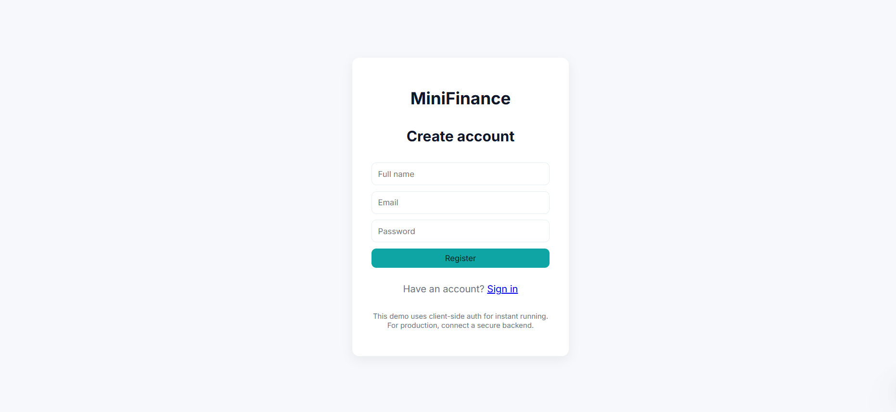

# Personal Finance App

A personal finance app to track income, expenses, and savings.  
Built with *HTML, CSS, JavaScript, Bootstrap, and **LocalStorage*.

---

## Features

- Sign-up / Login  
- Light & Dark Mode Dashboard  
- Add Income & Expenses  
- Transactions List  
- Reports & Charts  
- Export Data to CSV/Excel 

---

## Screenshots

### Sign-up Page


### Set-up Page


### Light Mode Dashboard


### Dark Mode Transactions List


### Reports and charts


---

## How to Run

1. Clone this repo:  
```bash
git clone https://github.com/yourusername/personal-finance-app.git 
